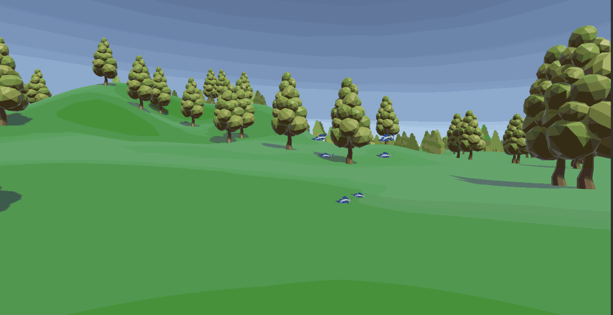

# MovementAnimationCurve
Using AnimationCurves to easily create complex but smooth and seemingly random movements in Unity

[You can find a write up here.](https://www.noveltech.dev/unity-complex-movements-animation-curve/)  
